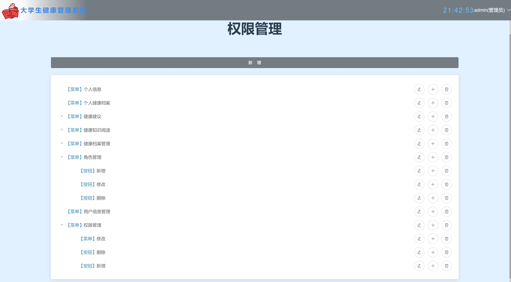

 
## 查看主页获取源码

> **作者介绍**： **✌**全网粉丝10W+本平台特邀作者、博客专家、CSDN新星计划导师、java领域优质创作者,博客之星、掘金/华为云/阿里云/InfoQ等平台优质作者、专注于项目实战 **✌**

  

### 一、作品包含

源码+数据库+设计文档万字+全套环境和工具资源+部署教程

### 二、项目技术

前端技术：Html、Css、Js、Vue

数据库：MySQL

后端技术：Java、Spring Boot、MyBatis

### 三、运行环境

开发工具：IDEA

数据库：MySQL8.0

数据库管理工具：Navicat10以上版本

环境配置软件： JDK1.8+Maven3.6.3

前端Nodejs：16

### 四、项目介绍
项目编号：springbootA049

个人信息、个人健康档案、健康建议、健康知识阅读、健康档案管理、角色管理、用户信息管理、权限管理、体检数据分析（模拟）
体检数据分析为模拟的数据，并不是真正的从数据库去拿数据，如果不需要的话可以直接去菜单中删掉该模块即可。

### 五、运行截图

